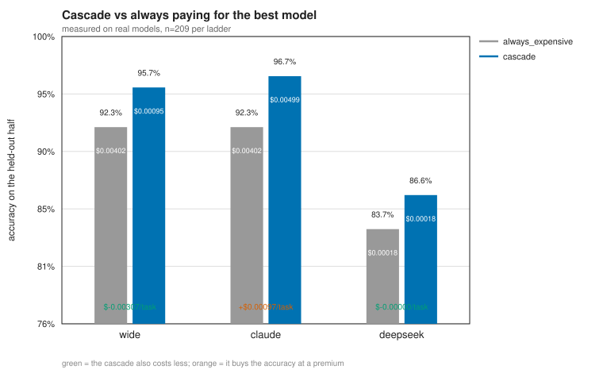
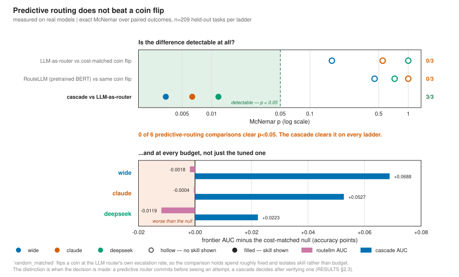
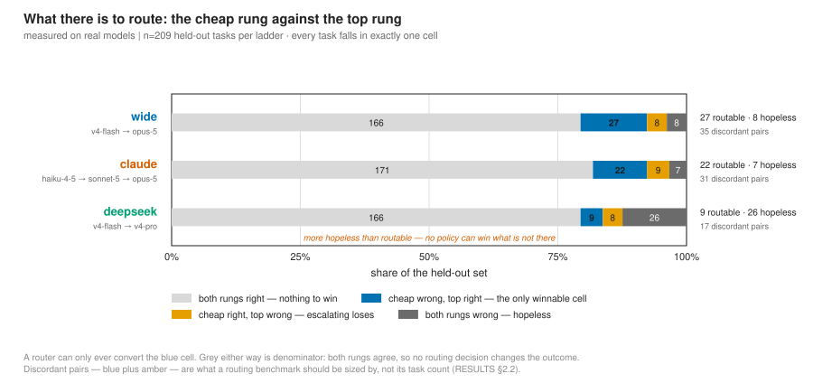
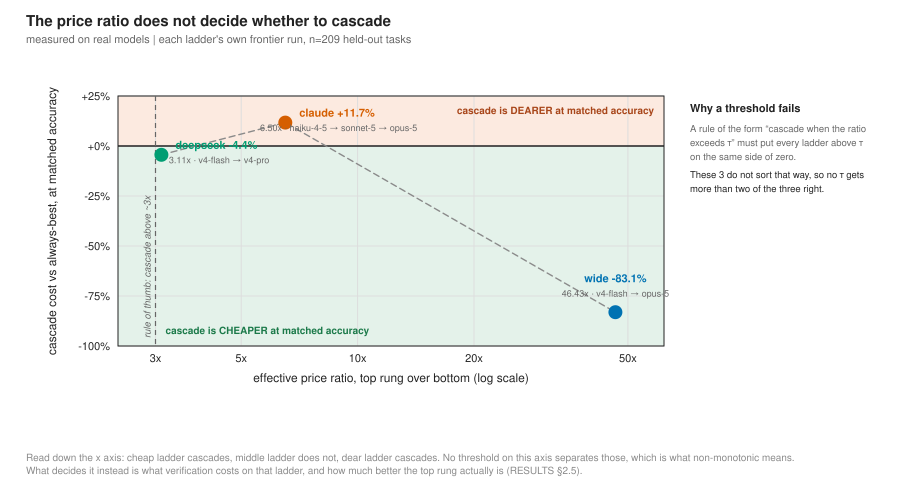
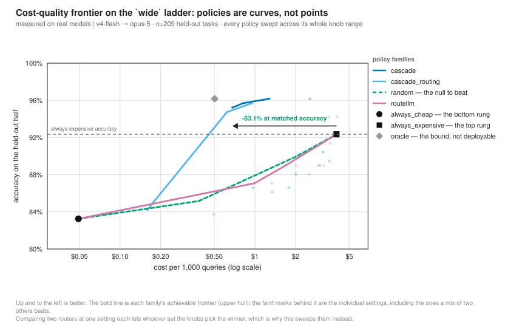
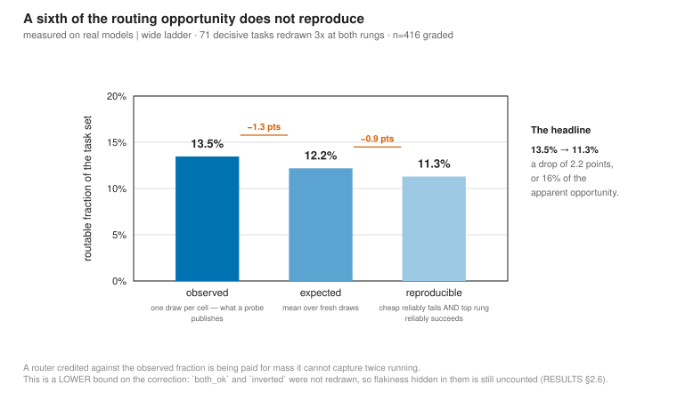
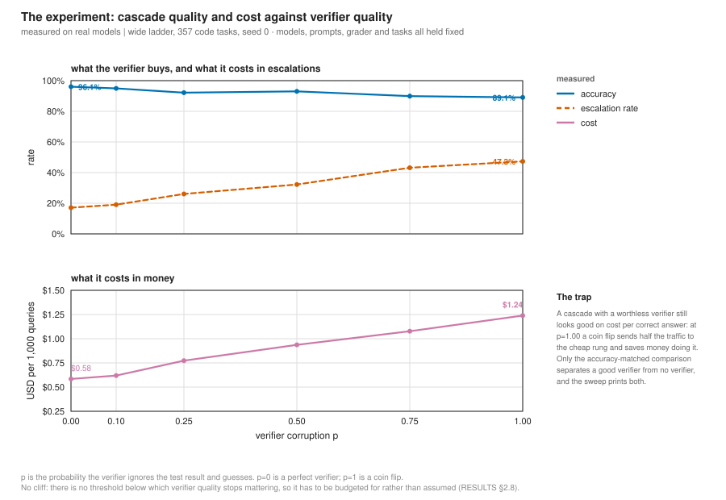
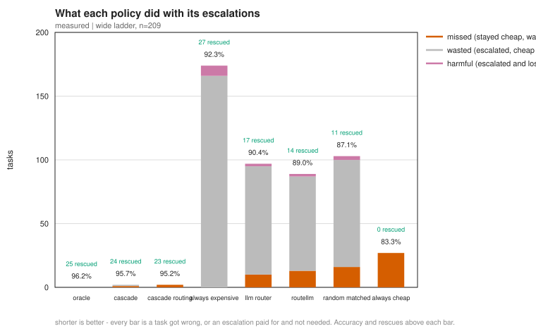

# Results

Every number here is measured on real models and replayable from `cache/` for
$0.00. Nothing on this page is carried over from a superseded run.

For how the benchmark is built, read [METHOD.md](METHOD.md) — which also carries
the quarantine rule and the bugs the project found in itself. For what bounds
these claims, [LIMITATIONS.md](LIMITATIONS.md).

---

## 1. What was measured

Nine policies over 417 tasks on three model ladders. Every response is a real
API call, committed to `cache/`, and the entire analysis regenerates offline
for $0.00 with no API key.

| | |
|---|---|
| tasks | **417** — 357 MBPP+ code, 60 MATH-500 level 5 |
| ladders | **3** — `wide` (flash→opus), `claude` (haiku→sonnet→opus), `deepseek` (flash→pro) |
| policies | **9**, including an oracle bound and a cost-matched random null |
| real responses | **5,075** |
| total spend | **$8.5146** |
| tests | **256 passing**, plus one end-to-end reconciliation against the committed results behind `pytest -m slow` |

---

## 2. What the data says

### 2.1 The cascade beats always-paying-for-the-best on two ladders of three

Pre-registered comparison, exact McNemar over paired outcomes, n=209 held-out
tasks per ladder.

| ladder | cascade | always_expensive | Δ acc | p | Δ cost/task |
|---|---|---|---|---|---|
| `wide` | **95.7%** | 92.3% | +3.3% | **0.039** | **−$0.00307** |
| `claude` | **96.7%** | 92.3% | +4.3% | **0.012** | +$0.00097 |
| `deepseek` | 86.6% | 83.7% | +2.9% | 0.070 | −$0.00000 |



On `wide` the cascade is **more accurate and four times cheaper**. On `claude`
it buys accuracy at a **premium** — verification is not free when the cheap rung
is haiku and the maths half draws five samples from it.

**"Cheaper and better" is a `wide` result, and `claude` is the counter-example.**
The ladder has to be named for the claim to mean anything.

### 2.2 Most of a routing benchmark does no work

**4 of 8** pre-registered comparisons are detectable at n=209 on `wide` and on
`claude`; 1 of 8 on `deepseek`.

At n=100 it was **0 of 8**, and the reason is worth more than the result. Growing
the code half from 35 tasks to 357 raised the number of tasks that can
distinguish two routers *at all* from **7 to 73** on `wide` (56 routable + 17
inverted; 76 on `claude`, 31 on `deepseek`). Every other task is one both rungs
get right or both get wrong, and contributes nothing but denominator.

**Size a routing benchmark by its discordant pairs, not by its task count.**

### 2.3 Predictive routing does not beat a coin flip — six of six

`random_matched` flips a coin at `llm_router`'s own escalation rate, so the
comparison holds spend roughly fixed and isolates skill.

| comparison | `wide` | `claude` | `deepseek` |
|---|---|---|---|
| `llm_router` vs `random_matched` | p=0.167 | p=0.549 | p=1.000 |
| `routellm` vs `random_matched` | p=0.454 | p=1.000 | p=0.727 |
| `cascade` vs `llm_router` | **p=0.003** | **p=0.006** | **p=0.012** |



Neither a learned router (RouteLLM's pretrained BERT) nor an LLM-as-router beats
a cost-matched coin flip on any ladder, while the cascade beats both on every
ladder. RouteLLM's frontier AUC sits *below* the null on all three:
−0.0018 on `wide`, −0.0004 on `claude`, −0.0119 on `deepseek`. For scale, the
cascade's AUC gain over the same null is +0.0688, +0.0527 and +0.0223.

The distinction is **when the decision is made**. A predictive router commits
before seeing an attempt; a cascade decides after verifying one.

### 2.4 The third ladder has almost nothing to route

Whole task set, not the evaluation split — this is the cross-tab that says
whether a ladder has anything to route, so it uses every task. `n` differs by
ladder because a response that hit `max_tokens` is unmeasured, and a task
missing either rung cannot be placed in any cell.

| ladder | n | cheap rung | top rung | gap | routable | both_fail | McNemar |
|---|---|---|---|---|---|---|---|
| `wide` | 416 | 82.9% | 92.3% | **+9.4** | 56 | 15 | **0.000** |
| `claude` | 417 | 82.7% | 92.3% | **+9.6** | 58 | 14 | **0.000** |
| `deepseek` | 415 | 82.9% | 82.7% | **−0.2** | 15 | 56 | 1.000 |



The figure is drawn on the held-out half (n=209, from `scorecard.<ladder>.json`)
rather than the whole task set the table above uses, so its counts are smaller;
the shape of the three ladders is the same either way.

Reproduce with `python -m llm_routing.routable --ladders <ladder>`; the
committed output is `runs/routable.<ladder>.txt`. There used to be a warning
here that the `--real` flag was not optional, because without it the module ran
the mock ladder and printed a plausible-looking simulated cross-tab. The mock
path is gone: grading the cached responses costs nothing either, so simulating
this was never buying anything. `--real` is still accepted and does nothing.

> **This table is reproducible to about one task.** The code grader executes
> candidate solutions in a subprocess and treats a timeout as a failure, so a
> task whose expanded suite runs near the ceiling can grade wrong on a loaded
> machine and right on an idle one. Across three regenerations of the `wide`
> cross-tab the top rung has come back at **91.8%, 92.1% and 92.3%** — one task
> moving between `both_ok` and `inverted` each time — while `claude` and
> `deepseek` reproduced exactly. The cell counts that carry the argument —
> `routable` and `both_fail` — have never moved, and neither has the McNemar p.
> Treat the per-rung accuracies as ±0.3 points. See
> [LIMITATIONS.md](LIMITATIONS.md).

On `deepseek` the expensive rung is **not measurably better than the cheap one**.
Fifteen of 415 tasks are routable against 56 hopeless ones, and the whole
accuracy dynamic range is 7.5%. No policy can win what is not there — which is
why `always_expensive` lands *below* a cost-matched coin flip on that ladder.

> **A confound this design cannot separate.** What the data distinguishes is the
> **capability gap** between rungs as much as the price gap, and here the two
> move together: the ladder with the small price ratio is also the ladder whose
> rungs are equally capable. Three ladders cannot tell them apart.
>
> The supported claim is *"cascading pays when the top rung is genuinely better
> and verification is cheap."* Separating the two needs a ladder with a large
> price ratio and a small capability gap.

### 2.5 The price ratio does not decide whether to cascade

The project set out to test a price-ratio crossover: cascading should lose below
some ratio and win above it. Each ladder's own frontier run, n=209:

| ladder | effective ratio | cascade vs always-best, matched accuracy | verdict |
|---|---|---|---|
| `deepseek` | 3.11x | **−4.4%** (cheaper) | cascade |
| `claude` | 6.5x | **+11.7%** (dearer) | route |
| `wide` | 46.4x | **−83.1%** (much cheaper) | cascade |



**Not monotonic, and the middle row is why.** `claude` has the higher ratio of
the two close ladders and is the one where cascading costs more — because the
deciding term is not the price gap but **what verification costs on that
ladder**. On `claude` the cheap rung is Haiku and the maths half draws five
samples from it, and the middle rung refuses a temperature so it cannot be
verified at all. On `deepseek` both rungs accept one and the top rung is barely
better, so the cascade rarely escalates and rarely pays twice.

A router that picked its strategy from a price-ratio threshold would get
`claude` and `deepseek` backwards. This one reads the frontier instead, and
refuses to answer for a ladder that has none. That frontier, on `wide`:



The bold line is each family's achievable frontier — the upper hull, which is
what `findings.ratio_verdict` integrates — and the faint marks behind it are the
individual knob settings, including the ones a mix of two others beats.

> **The `deepseek` frontier is one policy short.** `cascade_routing` is not
> replayable from that ladder's cache, so it contributes no point to the
> `deepseek` curve while it does to the other two. The run says so on every
> execution (*"not replayable from this cache, so absent from the frontier
> below"*). Stated here because the row above sits next to two that are
> complete: the `deepseek` verdict rests on `cascade` against
> `always_expensive`, both of which are fully measured.

### 2.6 A sixth of the routing opportunity is noise

71 decisive tasks, 3 fresh draws at both rungs, $0.3429.

| measure | routable fraction | counts |
|---|---|---|
| observed | 13.5% | one draw per cell — what a probe publishes |
| expected | 12.2% | mean over fresh draws |
| **reproducible** | **11.3%** | cheap reliably fails **and** the top rung reliably succeeds |



**The routable cell shrinks by 2.2 points, a sixth of its apparent size, once
you ask whether it reproduces.** A router credited against `observed` is paid
for mass it cannot capture twice running. (The `noise_share` field in the
artefact measures a related but different quantity — 7.2% of what fresh draws
say is there fails to reproduce. The sixth is the reduction in the headline
fraction, 13.5% → 11.3%.)

This is a *lower bound* on the correction: `both_ok` and `inverted` were not
redrawn, so flakiness hidden there is still uncounted.

### 2.7 Greedy decoding is not deterministic, for either provider

Across the **16** tasks carrying ≥5 reachable, untruncated draws at temperature
0, more than one distinct answer came back on **81%** of them for
`claude-opus-5` and **75%** for `deepseek-v4-flash`. Neither provider is
meaningfully more stable than the other.

Counted over `kind="answer"` rows at `temperature=0` in `cache/raw_calls.*.jsonl`,
grouped by (model, task), excluding draws that `models.is_reachable` rejects and
those that hit `max_tokens` — the same two exclusions every other table here
applies.

This is why the redraw above exists: a benchmark that takes one draw per model
per task is
partly measuring luck, and cannot tell you how much.

### 2.8 The cascade degrades smoothly with its verifier — the experiment

Everything above compares policies. This is the only part that *manipulates* a
variable: `sweep_degraded.py` corrupts the perfect code verifier by a controlled
amount, inside the code domain, holding the models, prompts, grader and tasks
fixed. `p` is the probability the verifier ignores the test result and guesses.

357 code tasks, `wide` ladder, real responses, $0.00 to run.

| corrupt `p` | 0.00 | 0.10 | 0.25 | 0.50 | 0.75 | 1.00 |
|---|---|---|---|---|---|---|
| accuracy | **96.1%** | 95.0% | 92.2% | 93.0% | 89.9% | 89.1% |
| $/task | **0.00058** | 0.00062 | 0.00077 | 0.00094 | 0.00108 | 0.00124 |
| escalation | 17.1% | 19.0% | 26.1% | 32.2% | 43.1% | 47.3% |



Cost rises monotonically and accuracy falls across the range — seven points for
a verifier taken from perfect to a coin flip. **There is no cliff**, which is
the useful part: no threshold exists below which verifier quality stops
mattering, so it has to be budgeted for rather than assumed.

The trap this also exposes: **a cascade with a worthless verifier still looks
good on cost-per-correct.** At `p = 1.00` a coin flip sends half the traffic to
the cheap rung and saves money doing it. Only the accuracy-matched comparison
separates a good verifier from no verifier, and the sweep prints both.

### 2.9 Resampling the cheap rung does not substitute for escalating

A cascade has one move when verification fails: climb. That is a choice, and at
a 117x realized price ratio it is not an obvious one — for the price of a single
Opus call you could take a hundred more DeepSeek draws. *Resample or Reroute?*
([2607.08665](https://arxiv.org/abs/2607.08665)) frames the two as competing
uses of one budget and reports cascades losing on saturated tasks.

Answered here on the decisive tasks, from draws already on disk, for $0.00:

Each row uses the strongest cheap-side strategy that is actually *deployable* in
that domain: with MBPP+'s tests you can take the best of nine draws and know
which one passed; on maths there is no exact check, so the best you can do is
vote.

| | escalate once | 9 more cheap draws | cost of the cheap option |
|---|---|---|---|
| code (n=5) | **5/5** | 0/5 — best-of-9, tests | 7% |
| math (n=10) | **9/10** | 4/10 — majority-of-9 | 7% |

**Escalation wins, and it is not close.** Nine extra cheap draws at 7% of the
cost recover none of the code tasks and fewer than half the maths ones. On the
tasks a cascade actually escalates, the cheap rung does not have the answer at
any sample count — the capability is missing, not the luck.

An oracle best-of-9 on the maths row reaches 7/10, but picking that draw needs
an exact check that does not exist for maths — which is the same verifier gap
the degradation sweep below prices, arriving from the other direction.

Their result and this one do not conflict: theirs is about saturated tasks where
both rungs already succeed, and this measures the cell where they differ, which
is the only cell a router can win.

---

## 3. What each policy got right and wrong

Accuracy alone cannot tell you whether a router escalated the right ten tasks or
escalated everything. `llm_routing/scorecard.py` joins each policy's decision
against what the two rungs could actually do. `wide` ladder, 209 tasks:



| policy | acc | $/task | rescued | no-top | missed | wasted | harmful | prec |
|---|---|---|---|---|---|---|---|---|
| `oracle` | 96.2% | 0.00050 | 25 | 2 | 0 | 0 | 0 | 100% |
| `cascade` | 95.7% | 0.00095 | 24 | 2 | 1 | 1 | 0 | 73% |
| `cascade_routing` | 95.2% | 0.00068 | 23 | 2 | 2 | 0 | 0 | 74% |
| `always_expensive` | 92.3% | 0.00402 | 27 | 0 | 0 | **166** | **8** | 13% |
| `llm_router` | 90.4% | 0.00309 | 17 | 0 | 10 | 85 | 2 | 15% |
| `routellm` | 89.0% | 0.00192 | 14 | 0 | 13 | 74 | 2 | 15% |
| `random_matched` | 87.1% | 0.00293 | 11 | 0 | 16 | 84 | 3 | 11% |
| `always_cheap` | 83.3% | 0.00005 | 0 | 0 | 27 | 0 | 0 | — |

- **rescued** — escalated a routable task, the only way to win
- **no-top** — got a routable task right *without* the top rung: cheap-rung
  self-consistency, or a middle rung
- **missed** — stayed cheap and got it wrong
- **wasted** — escalated a task the cheap rung already had
- **harmful** — escalated a task the cheap rung had right, and got it wrong

`always_expensive` escalates 201 tasks to buy 27 rescues and burns **$0.71** on
escalations that could not improve the answer, losing 8 tasks the cheap rung had
already answered. `cascade` wastes **$0.084** — eight times less — because
verification tells it which escalations are worth making.

`always_mid` is measured on `claude`, the only three-rung ladder: **88.5%**,
solving **12 of 22** routable tasks without ever reaching Opus. The middle rung
does real work.

---

## 4. What it cost

| | |
|---|---|
| `wide` cache | $5.5878 |
| `claude` cache | $2.8498 |
| `deepseek` cache | $0.0769 |
| **total** | **$8.5146** over 5,075 real responses |

The three rows are rounded independently and so sum to $8.5145; the total is the
unrounded sum, $8.514596.

The measured session accounts for **$4.4298** of that: pool screen $0.0301,
code-half census $0.8804, `both_fail` redraw $0.2497, decisive redraw $0.3429,
buy D $0.0000 (entirely cached), `deepseek` ladder $0.0769, `claude` ladder
$2.8498. The two ladder figures are exact totals over their cache files; the
rest are what each paid tool reported when it ran.

**Cross-ladder cache reuse is worth $1.77.** The ladder is deliberately absent
from the cache key, so 417 of `wide`'s Opus answers serve `claude`'s top rung
(**$1.70**) and 657 of its flash answers serve `deepseek`'s bottom rung
($0.07), for nothing.

**Estimates run low.** The `claude` buy came in **52% over** a $1.87 estimate;
the call count was exact (1489 vs 1491) and the per-call cost was 53% high,
because the estimate used Opus token counts as a length proxy and weaker models
write longer answers to the same question. A cheaper model is not a
proportionally cheaper call.

---

## 5. What bounds these findings

Two things matter most, and both are measured rather than asserted:

1. **The verifier that produces the signal is not the verifier that ships.** The
   code half is graded by executing the tests MBPP+ supplies; a deployed router
   does not have them. The degradation sweep is the experiment that prices
   that gap.
2. **Price ratio and capability gap are confounded** — see the note under
   [the third ladder](#24-the-third-ladder-has-almost-nothing-to-route).

[LIMITATIONS.md](LIMITATIONS.md) states these and six smaller ones once each,
with what would settle them.

---

## 6. Reproducing everything

```bash
ROUTER_MODE=replay python scripts/run_all_ladders.py   # all 3 ladders, $0.00
python -m llm_routing.stats --results runs/results.wide.jsonl
```

The full three-ladder driver takes **about 75 minutes** and prints one line per
step. For a quick look, `--ladders wide` is about half an hour. Almost all of
that is the code grader: every step re-executes 357 expanded MBPP+ suites in
subprocesses, and there are four to six steps per ladder.

The published figures were produced by **deleting every derived artefact** and
regenerating all three ladders from the response cache. 0 calls reached a
backend; 0 rows are simulated.

Analysis entry points, each runnable as `python -m llm_routing.<name>`:
`run_eval` (per-policy run), `frontier` (cost-quality curves and AUC), `stats`
(McNemar and paired bootstrap), `scorecard` (per-policy error attribution),
`routable` (the cross-tab), `sweep_degraded` (verifier-degradation curve),
`plot` (SVGs).

All of them read `ROUTER_MODE`, which defaults to `replay`, and all of them
refuse to run under `ROUTER_MODE=mock` — a module that writes something
quotable does not run in a mode that fabricates its inputs. See
[METHOD.md](METHOD.md#the-three-modes-and-why-one-of-them-cannot-produce-a-number).

Paid tools, each of which prints a costed plan and refuses to spend without
`--go`: `scripts/provenance/redraw_decisive.py` (redraw or screen),
`scripts/provenance/record_missing.py` (buy the gap a replay needs).

---

## 7. Further work

1. **A verifier that needs no shipped tests** — the cheap model generating its
   own tests, or self-consistency over code. This addresses the limitation that
   currently bounds every claim on this page, and is more informative than
   another ladder.
2. **A ladder with a large price ratio and a small capability gap**, to separate
   the confound under [the third ladder](#24-the-third-ladder-has-almost-nothing-to-route).
3. **Redrawing `both_ok` and `inverted`**, to turn the routable fraction from a
   lower bound into a two-sided estimate.
